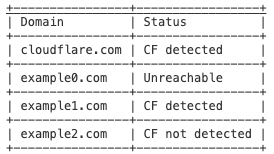
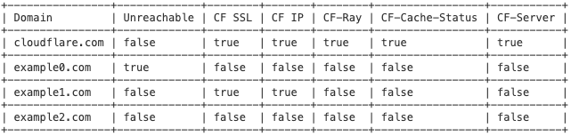
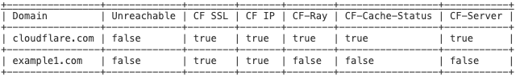

[](https://crates.io/crates/cfd) | [Documentation](https://docs.rs/cfd)
===

**CFD** is a tool that allows you to check one or more domains to see if they are protected by CloudFlare or not. The check is carried out based on five criteria: 3 headers in the HTTP response, IP, and SSL certificate issuer. The check result can be displayed on the screen or saved to a file.

## **Requirments**
To use Cfd you need to install Cargo and Rust.
Just paste into your terminal window: 
```bash
curl https://sh.rustup.rs -sSf | sh
cargo install cfd
```

## **Usage**
```bash
cfd [OPTIONS] <TARGET>
```
## **Arguments**
```bash
<TARGET>  A domain, domains divided by newline char or a file with domains.
```
## **Flags**
```bash
-h, --help       Prints help information
-V, --version    Prints version information
```
## **Options**
```bash
  -d               Outputs a detailed result for each domain based on five checks.
  -f               Outputs only domains without Cloudflare presence.
  -o <OUTPUT>      The path to the folder where the cfd_report.{txt or csv} file will be stored. If a file won't be specified, output will be printed to stdout. If the detailed flag is set, the output will include checking details.
  -h, --help       Print help
  -V, --version    Print version
```
## **Usage examples**

Every example will be shown with this set of domains: cloudflare.com, example0.com, example1.com, example2.com
### 1. Not detailed and not filtered output. If you provide a folder for outputting the result through the `-o` option, the result will be written in the form of `cfd_report.csv`
```bash
cfd resources/cfd_work.txt
```
### Output:

### 2. Detailed and not filtered output to stduout. If you provide a folder for outputting the result through the `-o` option, the result will be written in the form of `cfd_report.csv`
```bash
cfd resources/cfd_work.txt -d 
```
### Output:

### 3. Detailed and filtered output to stduout. If you provide a folder for outputting the result through the `-o` option, the result will be written in the form of `cfd_report.csv`
```bash
cfd resources/cfd_work.txt -d -f 
```
### Output:

### 4. Detailed and filtered output to stduout. If you provide a folder for outputting the result through the `-o` option, the result will be written in the form of `cfd_report.txt`
```bash
cfd resources/cfd_work.txt -f 
```
### Output:
cloudflare.com  
example1.com

## **In-Code examples**
### Complex checking:
```rust
use cfd::run;
#[tokio::main]
async fn main(){
    let target = "example.com\ncloudflare.com";
    let checker = run(target.to_string()).await.unwrap();
    assert_eq!(checker.cf_detected_domains().await.len() == 1, true);
}
```
### Check if an IP belongs to the Cloudflare IP range:
```rust
use cfd::cf_ips::CFIPs;
#[tokio::main]
async fn main(){
    let cf_ips = CFIPs::load().await.unwrap();
    assert!(cf_ips.check_ip_v4("131.0.72.1"));
}
```

## **Donation**

BTC: bc1qwp5pfsqeu0m00jsrsslv76j7x5jkv3z96wm0lz  
BuyMeACoffee: https://www.buymeacoffee.com/arg2u

## **License**

MIT
